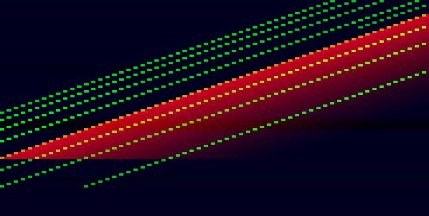
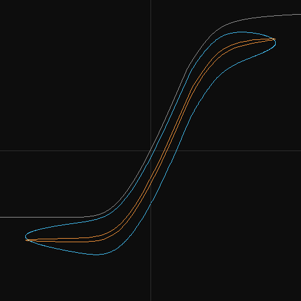
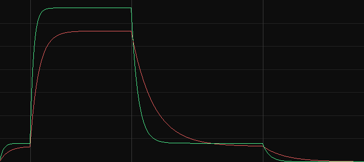

# Viz evidence — engine state as pictures

Date: 2026-07-24. Host: Fedora 44, GCC. Command: `make viz`; every number
below is from that run, and the exhibit asserts each of them.

## What this adds

Three offline pictures of state the WAVs cannot carry. The engine is not
touched: `src/` gains nothing, links nothing, and loses no freestanding
property. The exhibit reads the public structs the tests already read
(`o.gen.keyed_gain[]`, `d.pre`/`d.post`, `r.horn_dev`), so visualization is
a driver-layer reader and nothing more.

- `driver/viz.{c,h}` — three functions: a clipped pixel, a clipped line, and
  a PNG writer. Same posture as `wav.c`: plumbing this repo writes rather
  than vendors (design.md dependency policy).
- `driver/exhibit_viz.c` — the three panels, under the standard exhibit
  contract: rendered twice, FNV-64 compared, every claim a measured number,
  and a PASS/FAIL verdict on all of it.
- `Makefile` — `make viz`.

The images are presentation; the printed numbers are the evidence. No
panel's verdict depends on how it was shaded.

## The PNG writer

8-bit RGB, one **stored** (uncompressed) deflate block per row. A stored
block carries its payload verbatim behind a five-byte header, so the whole
encoder is the CRC-32 and the Adler-32 — no Huffman coder, no LZ window.
The row-per-block choice makes block boundaries coincide with row
boundaries, which is why the writer has no state machine; the ceiling it
buys is a width of 21844 px (the 65535-byte block limit), asserted.

Validated externally: signature, per-chunk CRC, `zlib.decompress` of the
IDAT stream, filter bytes, and round-tripped pixels.

**Known cost.** Stored blocks mean the artifacts are ~100-900x larger than
a real deflate would make them (2.2 MB here against ~9 KB), because these
images are mostly flat. That is the price of an encoder with no compressor
in it. The named upgrade, if repo size ever demands it, is fixed-Huffman
deflate with a run-length matcher — the flat spans and the repeated rows
are exactly what distance-1 and distance-stride matches eat. Until then,
`oxipng` over `docs/viz/` is a lossless one-liner that changes nothing the
exhibit asserts.

## 1. Wheel roll — `viz/wheel-roll.png`

The 91-wheel bank against time (720 x 364) through a chromatic walk up the
whole 61-key compass at registration 888888888, percussion on, at the
shipped wear 0.2. 90 ms a key, held for half of it — the 45 ms gap clears
the 34 ms percussion re-arm RC, so every key fires the trigger. Wheel 91 on
top, wheel 1 at the bottom. Green is the keyed bank, red the percussion
envelope, blue the static bleed-bus weights; per-column peak-hold, since a
percussion transient is shorter than the 7.6 ms a column spans.

    keyed wheels 79, spanning 13..91 (foldback ceiling 91)
    percussion touched 61 wheels
    bleed-bus weights nonzero on 91 of 91 wheels
    FNV64 49c7b9d4eb5c62ed (two runs identical)

79 wheels is exactly `TW_WHEEL_MAX - TW_WHEEL_MIN + 1`: the walk plus a full
registration reaches every wheel the manual can address and not one more.
The span landing on 13..91 is the foldback rule (constants sec 4) drawn
rather than asserted — the top of the walk folds back down instead of
running off the generator, and the bottom stops at the manual floor. The
blue stripes run in the generator's bin order, not the musical one, which
is the design.md claim that leakage is structured and not uniform.

Bottom twelve rows carry blue only: wheels 1-12 are below the manual floor,
so on this instrument they leak and never sound.

Nine parallel diagonals is the busbar drawn: one per drawbar tap, each at
its own semitone offset, all nine walking the compass together. Where they
run off the top they reappear lower down — that is the foldback, and it is
the same event the 13..91 span reports as a number.

Shading (`roll_shade`) is linear in dB with a gamma of 1.5, against a
reference fixed in the source rather than fitted per image: two rolls only
mean anything side by side — wear 0 against wear 1, say — if the same gain
shades the same grey in both. REF = 4.0 is the loudest a single wheel gets
under a full registration once taper and robbing have had their say; the
-96 dB floor clears the quietest bleed weight, which is what makes the blue
a layer instead of a black band. Measured re REF: keyed peak -2.2 dB,
percussion peak -11.9, bleed weights -72.5..-82.1.

The red band is wider than a percussion tap because it is an envelope, not
an event: at the fast decay each trigger stays above the floor for a couple
of seconds, so successive keys' tails overlap. Peak-hold inside the column
keeps them honest rather than aliasing them away.

## 2. Drive hysteresis — `viz/drive-hysteresis.png`

Input against output for the preamp stage at drive 0.8, input amplitude 10
against the X_ref = 8 nominal, plotted as a trajectory (512 x 512). Grey is
the memoryless reference — `post * tw_drive_curve(pre * x)`, what a bare
waveshaper at this drive would trace, with `pre`/`post` read off the stage
rather than recomputed. Blue is 55 Hz, orange 440 Hz, each one full cycle
after a 0.5 s settle past the 50 ms follower release and the 10 Hz coupling
cap.

    departure from the memoryless curve: 2.253 at 55 Hz, 1.407 at 440 Hz
    FNV64 608132d05a22a2c9 (two runs identical)

A memoryless stage would score 0 at both frequencies and the traces would
lie on the grey curve. They do not: the bias follower shifts the operating
point and the coupling cap subtracts the DC image the asymmetric curve
creates, so the trajectory becomes a loop, and the loop is wider at 55 Hz
than at 440 Hz because the 10 Hz highpass still partly tracks the lower
one. This is the single picture that separates the M5/warmth stage from a
waveshaper (design.md model-depth doctrine).

## 3. Rotor telemetry — `viz/rotor-telemetry.png`

Horn (green) and drum (red) rate in Hz against 36 s (720 x 320): chorale
from 0, tremolo at 3 s, chorale at 13 s, brake at 26 s. Gridlines every
1 Hz, verticals at the mode changes. Rate is read as `target + dev`, the
model quantity.

    to 95 % of the step (three time constants of the slip lag):
      horn rise 1.00 s (3 tau = 1.00)
      drum rise 2.50 s (2.50)
      drum fall 6.50 s (6.50)
    FNV64 3ec5e53d4a04bdbf (two runs identical)

All three land on their constants exactly, which makes the picture a
reading of sec 15.1 rather than an illustration of it. The asymmetry is the
point: the drum's ~6.5 s fall is the one sourced inertia figure in the
rotary set [RS, service acceptance], and against the horn's ~1 s rise it is
what the ear hears as the cabinet taking its time to settle. Brake pulls
both to the front stop.

## Verdict

    exhibit verdict: PASS

## Open

- Not built here, in rough order of what they would show: contact raster
  (61 x 9, microsecond zoom, velocity stagger against depth), scanner node
  field (19 taps against time), wear ledger (deviation banks against wheel
  index), spectrogram (wants the radix-2 FFT design.md already names), and
  a live ANSI panel in `tw91`.
